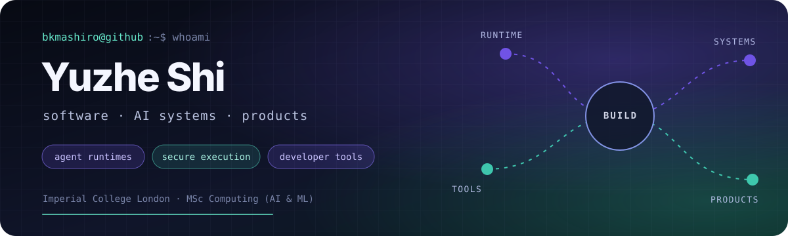

[**note.yuzhes.com**](https://note.yuzhes.com)

## Hello

I'm Yuzhe, a software engineer and MSc Computing (AI & ML) student at Imperial College London. I build across the stack, from sandboxed runtimes and coding-agent infrastructure to compilers and user-facing AI products.

My current research focuses on secure code execution and runtime isolation for serverless and agent workloads. Outside research, I like turning ideas into things people can actually use.

## Shipping

| Product | What I built | Status |
| --- | --- | --- |
| [**Zao · 灶**](https://zao.yuzhes.com) | A context-aware iOS cooking companion that brings recipes, pantry, meal plans, and hands-free cooking into one flow. | **Launching soon** |
| [**Kotodama**](https://kotodam.ai) | A multilingual AI narrative-learning app where stories remember your choices and turn dialogue, vocabulary, and grammar into a connected learning path. | **Web live** · iOS coming soon |

## Selected work

### Agent infrastructure and developer tools

| Project | What it does | Stack |
| --- | --- | --- |
| [**Agent Workspace**](https://github.com/bkmashiro/agent-workspace) | A workspace-local command, package, and event runtime shared by coding agents and humans. | Go |
| [**SourcePin**](https://github.com/bkmashiro/sourcepin) | Pins UI feedback to durable DOM and source locations, then keeps final acceptance with the human. | TypeScript, Vite, MCP |

### Systems, languages, and frameworks

| Project | What it does | Stack |
| --- | --- | --- |
| [**shimmy-wasm**](https://github.com/bkmashiro/shimmy-wasm) | Runs untrusted code in a capability-constrained WASM/WASI sandbox for serverless environments. | Python, WebAssembly, WASI |
| [**RedScript**](https://github.com/bkmashiro/redscript) | A typed language, compiler, LSP, and toolchain that emits vanilla Minecraft datapacks. | TypeScript, compilers |
| [**@faster-crud**](https://github.com/bkmashiro/nest-faster-crud) | An end-to-end type-safe CRUD toolkit spanning 18 backend, ORM, and frontend packages. | TypeScript, NestJS, React, Vue, Svelte |

### Platforms

| Project | What it does | Links |
| --- | --- | --- |
| [**Leverage OJ**](https://github.com/ThinkSpiritLab/leverage-frontend-neo) | A full-stack online judge with competitive ranking, AI-assisted game design, and sandboxed execution. | [backend](https://github.com/ThinkSpiritLab/leverage-backend-neo) · [judge](https://github.com/bkmashiro/botzone-neo) |
| [**VibeCheck**](https://github.com/bkmashiro/vibecheck) | Analyzes GitHub commit histories for AI-assisted vibe coding, with user and repository scores, leaderboards, and badges. | [git-vibe.pages.dev](https://git-vibe.pages.dev) |

## Tech stack

**Languages**

**Web, apps, and APIs**

**Systems, AI, and data**

**Also used across current projects:** SwiftUI · Hono · Fastify · Drizzle ORM · TypeORM · MCP · CodeMirror · VS Code Extension API

## Research

Current: serverless sandboxing, secure code execution, and runtime isolation for agent workloads at Imperial College London.

Previous work includes graph neural networks, efficient ML, and AI watermark removal.

---

Cooking and baking, photography, Minecraft, travel, and learning Japanese when I'm away from the terminal.
